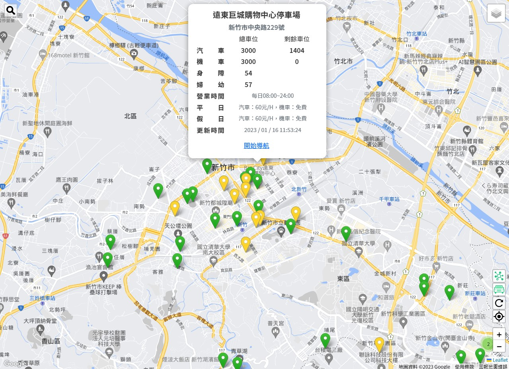
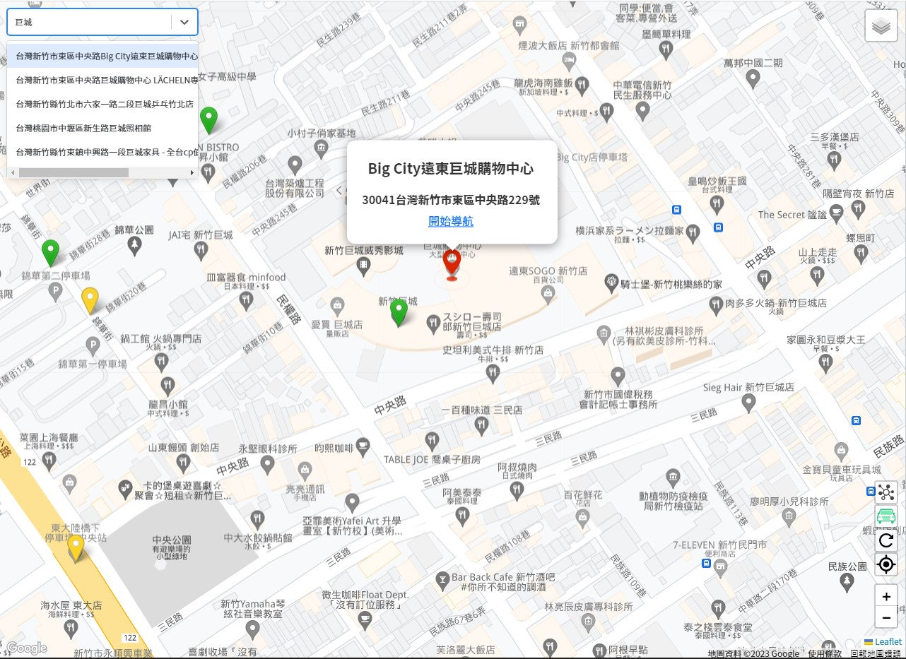
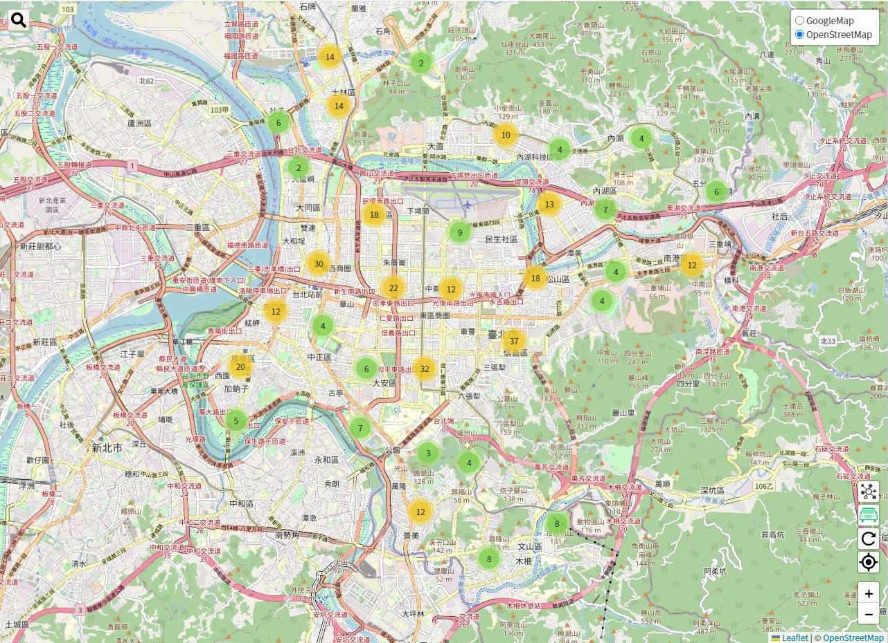

# Parking Finder

<a href="https://parking-finder-yuwen.netlify.app/map" target="_blank">DEMO 連結</a>
<br/>
<br/>
# 畫面預覽

|                                                                                                  |                                                                                                        |
| :----------------------------------------------------------------------------------------------: | :----------------------------------------------------------------------------------------------------: |
|         顯示停車場資訊        |                 指定地點搜尋                 |
|        圖磚切換(右上角)       |         標記定位        |

<br />
<br />

# 功能

- 使用者可以縮放或移動地圖的顯示區域
- 使用者可以輸入地標或地址，以瀏覽指定區域
- 使用者可以切換底圖圖磚為 GoogleMap （預設）或 OpenStreetMap
- 使用者可以定位當下位置
- 使用者可以從地圖上瀏覽當前區域的停車場位置
- 使用者可以選擇僅顯示有空位的停車場（預設），或所有停車場
- 使用者可以選擇群組化停車場標記（預設），或展列所有停車場標記
- 使用者可以查看停車場詳細資訊
- 使用者可以選定停車場並進行導航
- 使用者可以刷新停車場資料
- 停車場標記會依 "剩餘停車格數" 變換顏色
  - 綠色: 剩餘停車格數大於 30個
  - 黃色: 剩餘停車格數介於 1 ~ 29個
  - 紅色: 剩餘停車格數為 0個
  - 黑色: 無剩餘停車格資料


<br/>

# 使用方法

須確認已安裝 node.js 與 npm

1.打開終端機，Clone 專案至本機

```
git clone https://github.com/Yuwen-ctw/parking_finder.git
```

2.進入專案資料夾

```
cd parking_finder
```

3.安裝 npm 套件

```
npm install
```

4.替換 GoogleMap API_KEY（暫緩使用 GoogleMap 服務者可忽略此步驟）
  1.  <a href="https://developers.google.com/maps">GoogleMap API 申請連結</a>

  2. 打開 index.html 
  3. 尋找下方 script 標籤，並於 [YOUR_API_KEY] 處更換成已申請的API_KEY

```
<script type="text/javascript" src="https://maps.googleapis.com/maps/api/js?key=[YOUR_API_KEY]&libraries=places"></script>
```

5.啟動提供測試資料的伺服器

```
npm run dev-server
```
- 欲使用即時資料者，請參考 <a href="https://data.gov.tw/license">政府資料開放授權條款</a> 並取得API後，至 vite.config.ts 替換 proxy 中的所有 target 欄位 

6.啟動專案
```
npm run dev
```
- 成功後請參考終端機訊息並造訪指定網址，預設網址為 http://127.0.0.1:5173

<br/>

<br/>

## 主要開發工具與套件

- vite - 建立環境
- react - 建構 UI
- bootstrap - 處理樣式
- leaflet - 建構地圖
- proj4 - 轉換座標資訊
- dayjs - 轉換時間資訊
- axios - 處理 HTTP 請求
- json-server - 模擬 API
- netlify - 部屬網站
  <br/>
  <br/>


## 資料來源

- 地圖圖磚 - Google Map API, OpenStreetMap
- 地點搜索 - Google Place API
- 停車場資料 - 
  - 臺北市停車管理工程處［臺北市停車場資訊］［V2］ <a href="https://data.gov.tw/dataset/128435">連結</a>
  - 臺北市停車管理工程處［剩餘停車位數］［V2］ <a href="https://data.gov.tw/dataset/128435">連結</a>
  - 交通處［新竹市剩餘停車位資訊］ <a href="https://data.gov.tw/dataset/129136">連結</a>
  - <a href="https://data.gov.tw/license">政府資料開放授權條款</a>